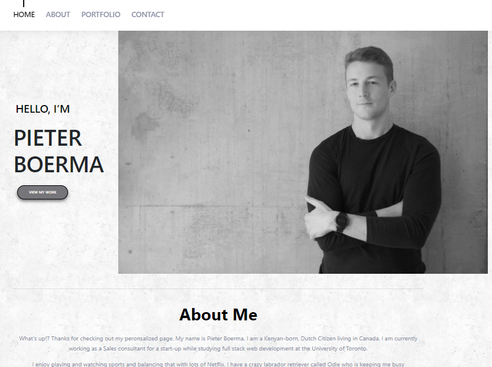

# Updated portfolio!

For this assingnment we are responsible for updating our profile with a page that is created with react that is broken down into multiple components

# Content

My profile includes updated projects that we have worked on over the past few years. Each project has the link to the deployed page as well as the repository to view. 

# Sources and programs used

CSS
HTML
Bootstrap
Google fonts
React
React_DOM
JSX
JS

# Future features

Still need to break the one big component into multiple components, including header and footer that stick with the screen.
Still need to deploy
Add search field for project details

# Website and Repo

https://pboerma.github.io/portfolio/
https://github.com/pboerma/portfolio
